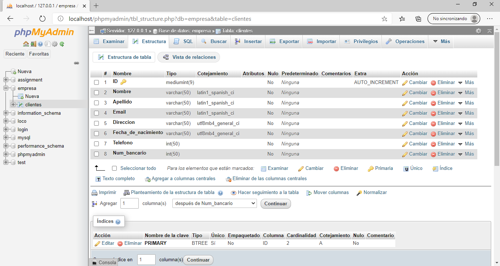
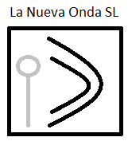
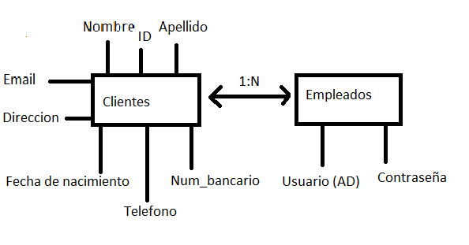

Proyecto FCT Oier
--------------------

La idea idea seria simular una empresa de telefonia en la que disponemos un servidor web interno con nuestras cuentas de usuario ( windows server 2012 AD ) y los datos que esos usuarios agregan de clientes se almacena en la base de datos de sql

--> windows server 2012 (MV)
--> Ubuntu (MV)

--------------------

Diario:

Dia 1 - 28 de Abril

--> Hoy e estado pensando la idea, el esquema de la red y el equipo a utilizar.

Dia 2 - 29 de Abril

--> Instalar VirtualBox en el equipo, despues comence con las descargas de los sistemas operativos a utilizar (windows server 2012, Ubuntu) y su respectiva puesta en marcha de las maquinas virtuales.

Dia 3 - 30 de Abril

--> Leer y documentarme sobre las pautas a seguir durante el proyecto como los videos a usar para guiarme...

Dia 4 - 5 de Mayo

--> La realizacion del analisis de contexto y empezar a escribir codigo de la web.

Dia 5 - 6 de Mayo

--> Empezar con la conexion entre un ldap encontrado en internet de prueba para ver algun ejemplo.

Dia 6 - 7 de Mayo

--> Instalacion y preparacion de mi directorio activo para cuando finalice con el ejemplo.

Dia 7 - 8 de Mayo

--> Terminar con la prueba del ejemplo de como conectar remotamente con Active Directory.

Dia 8 - 12 de Mayo

--> Hacer la documentacion del proyecto, pensar y creat la simulacion de la empresa y sus características.

Dia 9 - 13 de Mayo

--> Terminar con las características de la empresa.

Dia 10 - 14 de Mayo

--> Comenzar con la creacion del diseño de la pagina web.

Dia 11 - 18 de Mayo

--> Continuar con la creacion del diseño de la pagina web.

Dia 12 - 19 de Mayo

--> Comenzar con la contuccrion de la web.

Dia 13 - 20 de Mayo

--> Continuar con la contuccrion de la web.

Dia 14 - 21 de Mayo

--> Continuar con la contuccrion de la web.

Dia 15 - 22 de Mayo

--> Continuar con la contuccrion de la web.

Dia 16 - 25 de Mayo

--> Continuar con la contuccrion de la web.

Dia 17 - 26 de Mayo

--> Continuar con la contuccrion de la web.

Dia 18 - 28 de Mayo

--> Continuar con la contuccrion de la web.

Dia 19 - 2 de Junio

--> Comenzar con la documentacion del proyecto.

--------------------

1 -->Analisis contexto

¿A dónde quieres encaminar tu web? ¿Cuáles serían los objetivos?
  -La pagina web comenzara con un login simple que los datos de usuario corresponden al AD del servidor. Cuando el trabajador registre sus credenciales correctamente tendra acceso a la base de datos de clientes y sus modificaciones.
  -La pagina web a realizar tendra que cumplir con el objetivo de que un trabajador pueda agregar, modificar, eliminar o visualizar los datos de clientes

¿En que sector lo sitúas?
  -El sector de la empresa es el sector de las telecomunicaciones, pudiendo ser como ejemplo cualquier compañia de telefonia.

¿Cuáles son las características de ese sector?
  -La característica principal tendria que ser la comodidad para acceder a los datos de los clientes y la seguridad de esa informacion.

¿Conoces el sector?
  -No.

¿Conoces personas/grupos/empresas de ese sector?
  -Telefonica.

¿Cuál es el perfil de la gente que se mueve en ese sector?
  -Desde simples telefonistas asta tecnicos superiores o ingenieros en telecomunicaciones.

¿Qué incidencia crees que han tenido las nuevas tecnologías en ese sector?
  -Las nuevas tecnologias an echo que el sector se comvierta en algo global a nivel mundial con cantidades enormes de clientes potenciales.

¿Cómo lo han cambiado?
  -El uso del smartphone en todo el mundo y su conectividad revalorizo a las conpañias telefonicas.

¿A dónde crees que se encamina ese sector?
  -Pues sinceramente no lo se.

  3 --> Documentacion del Proyecto

  El proyecto esta realizado de la siguiente manera, por una parte encontramos una pagiona web este tiene las siguientes características, Una base de datos SQL con las caracteristicas que en la imagen de la parte superior hemos podido observar.
     
   
  

  .
  Por el otro ladon servidor de Windows Server 2012

  --------------------

<h3>  2 --> Empresa: </h3>

  La empresa se llama La Nueva Onda SL, esta empresa se dedica a la telefonia movil y por lo tanto gestiona una gran cantidad de clientes en la base de datos y debe de dar todas las facilidades a sus trabajadores a la hora de buscar nuevos clientes y notificar nuevas promociones a sus clientes.
   
  <h1>Logo</h1>
     
   
  
     
   
  <h1>Esquema de la base de datos</h1>
     
   
  

  --------------------

  3 --> Documentacion del Proyecto

  El proyecto esta realizado de la siguiente manera, por una parte encontramos una pagiona web este tiene las siguientes características, Una base de datos SQL con las caracteristicas que en la imagen de la parte superior hemos podido observar.
     
   
  

  .
  Por el otro ladon servidor de Windows Server 2012
