<h1>Proyecto FCT Oier</h1>
--------------------

La idea idea seria simular una empresa de telefonia en la que disponemos un servidor web interno con nuestras cuentas de usuario ( windows server 2012 AD ) y los datos que esos usuarios agregan de clientes se almacena en la base de datos de sql

--> windows server 2012 (MV)
--> Ubuntu (MV)

--------------------

<h3>Diario:</h3>

Dia 1 - 28 de Abril

--> Hoy e estado pensando la idea, el esquema de la red y el equipo a utilizar.

Dia 2 - 29 de Abril

--> Instalar VirtualBox en el equipo, despues comence con las descargas de los sistemas operativos a utilizar (windows server 2012, Ubuntu) y su respectiva puesta en marcha de las maquinas virtuales.

Dia 3 - 30 de Abril

--> Leer y documentarme sobre las pautas a seguir durante el proyecto como los videos a usar para guiarme...

Dia 4 - 5 de Mayo

--> La realizacion del analisis de contexto y empezar a escribir codigo de la web.

Dia 5 - 6 de Mayo

--> Empezar con la conexion entre un ldap encontrado en internet de prueba para ver algun ejemplo.

Dia 6 - 7 de Mayo

--> Instalacion y preparacion de mi directorio activo para cuando finalice con el ejemplo.

Dia 7 - 8 de Mayo

--> Terminar con la prueba del ejemplo de como conectar remotamente con Active Directory.

Dia 8 - 12 de Mayo

--> Hacer la documentacion del proyecto, pensar y creat la simulacion de la empresa y sus características.

Dia 9 - 13 de Mayo

--> Terminar con las características de la empresa.

Dia 10 - 14 de Mayo

--> Comenzar con la creacion del diseño de la pagina web.

Dia 11 - 18 de Mayo

--> Continuar con la creacion del diseño de la pagina web.

Dia 12 - 19 de Mayo

--> Comenzar con la contuccrion de la web.

Dia 13 - 20 de Mayo

--> Continuar con la contuccrion de la web.

Dia 14 - 21 de Mayo

--> Continuar con la contuccrion de la web.

Dia 15 - 22 de Mayo

--> Continuar con la contuccrion de la web.

Dia 16 - 25 de Mayo

--> Continuar con la contuccrion de la web.

Dia 17 - 26 de Mayo

--> Continuar con la contuccrion de la web.

Dia 18 - 28 de Mayo

--> Continuar con la contuccrion de la web.

Dia 19 - 2 de Junio

--> Comenzar con la documentacion del proyecto.

Dia 20 - 3 de Junio

--> Comenzar con la documentacion del proyecto.

Dia 21 - 4 de Junio

--> Comenzar con la documentacion del proyecto.

Dia 22 - 8 de Junio

--> Finalizar con la documentacion del proyecto.

--------------------

<h3>1 -->Analisis contexto </h3>

¿A dónde quieres encaminar tu web? ¿Cuáles serían los objetivos?
  -La pagina web comenzara con un login simple que los datos de usuario corresponden al AD del servidor. Cuando el trabajador registre sus credenciales correctamente tendra acceso a la base de datos de clientes y sus modificaciones.
  -La pagina web a realizar tendra que cumplir con el objetivo de que un trabajador pueda agregar, modificar, eliminar o visualizar los datos de clientes

¿En que sector lo sitúas?
  -El sector de la empresa es el sector de las telecomunicaciones, pudiendo ser como ejemplo cualquier compañia de telefonia.

¿Cuáles son las características de ese sector?
  -La característica principal tendria que ser la comodidad para acceder a los datos de los clientes y la seguridad de esa informacion.

¿Conoces el sector?
  -No.

¿Conoces personas/grupos/empresas de ese sector?
  -Telefonica.

¿Cuál es el perfil de la gente que se mueve en ese sector?
  -Desde simples telefonistas asta tecnicos superiores o ingenieros en telecomunicaciones.

¿Qué incidencia crees que han tenido las nuevas tecnologías en ese sector?
  -Las nuevas tecnologias an echo que el sector se comvierta en algo global a nivel mundial con cantidades enormes de clientes potenciales.

¿Cómo lo han cambiado?
  -El uso del smartphone en todo el mundo y su conectividad revalorizo a las conpañias telefonicas.

¿A dónde crees que se encamina ese sector?
  -Pues sinceramente no lo se.

  --------------------

  <h3>2 --> Empresa:</h3>

  La empresa se llama La Nueva Onda SL, esta empresa se dedica a la telefonia movil y por lo tanto gestiona una gran cantidad de clientes en la base de datos y debe de dar todas las facilidades a sus trabajadores a la hora de buscar nuevos clientes y notificar nuevas promociones a sus clientes.
   
  Logo
     
   
  
     
   
  Esquema de la base de datos
     
   
  

  --------------------

  <h3>3 --> Documentacion del Proyecto</h3>
   
  3.1-La base de datos
   
  El proyecto esta realizado de la siguiente manera, por una parte encontramos una pagiona web este tiene las siguientes características, Una base de datos SQL con las caracteristicas que en la imagen de la parte superior hemos podido observar. Esta tiene las siguientes características el campo llamado ID es la clave plincipal de la tabla clientes cual tiene 8 campos, estos estan organizados de la siguiente forma, nombre, apellido, email, direccion y fecha de nacimiento son del tipo varchar con un numero maximo de 50 caracteres y luego encontramos los campos telefono o numero bancario que son tipo int.
     
   
  
   
   
  3.2-Autentificacion de credenciales
   
  Centrandonos en la parte del codigo de nuestra pagina web primero nos encontraremos con los siguientes dos archivos Login.php y ldap.php estos dos archivos contienen el codigo de la conexion desde nuestra web al servidor del AD usando el metodo Post como podemos observar en la parte izquierda de la foto adjuntada, por el tado contrario el lado derecho contiene el codigo del from donde insertaremos nuestras credenciales para acceder aplicacion y sus correspondientes style con el que le damos un toque mas corporativista como se puede apreciar en la segunda imagen.
     
   
  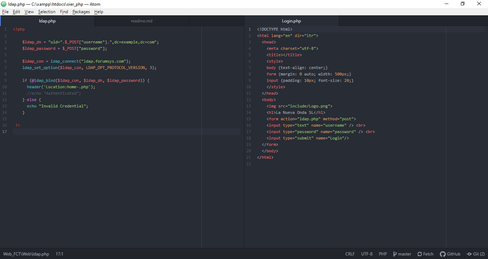
  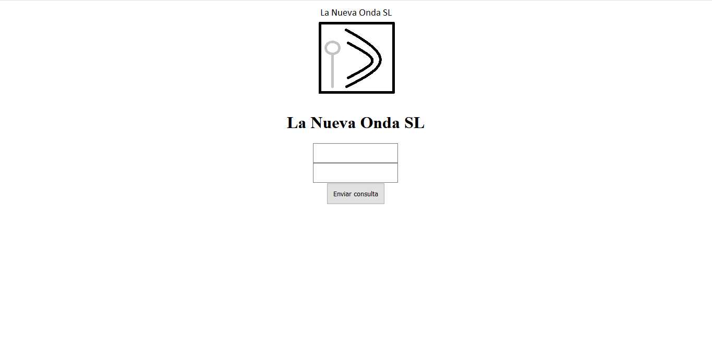
   
   
  3.3-Pagina principal
   
  Despues de añadir correctamente en el anterios from nuestas credenciales del AD nos dirigira al siguiente archivo .php con el nombre fe home_.php cual podremos utilizar para la colocacion de las caracteristicas de las ofertas de la compañia para facilitar la labor y eficiencia de los trabajadores, pero por ahora tiene unicamente el logo de la empresa, ademas como podemos apreciar en la foto de abajo este contienme en la parte superior una barra de navegacion por las diferentes pestañas de la web usando ul y li con sus correspondientes style.  
     
   
  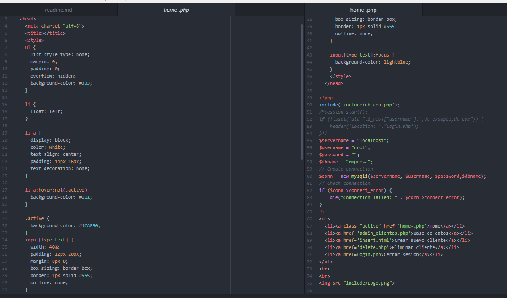
  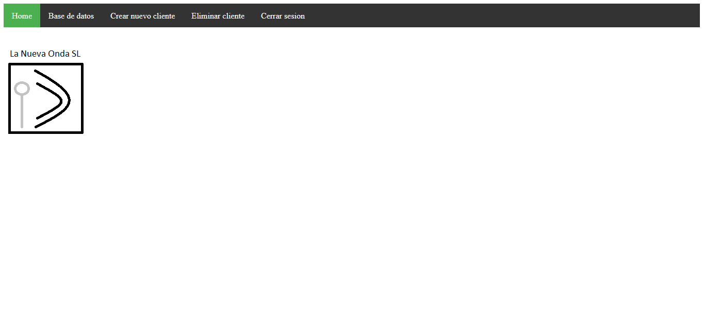
   
   
  3.4-Visializacion de datos de usuario
   
  Dentro de las funciones principales de nuestra web se encuentra la siguiente pestaña el cual esta nombrado de la siguiente manera admin_clientes.php, su funcion principal es poner de una manera sencilla y visualmente claro cuales son los clientes que posee la empresa y los datos de cada uno. Como podemos observar en la primera imagen de abajo en las lineas desde el 74 al 79 se realizar una consulta sql del tipo select, por lo contrario el from que encontramos despues sirven para la modificacion de los datos del cliente pero lo explicamos mas adelante. La segunda foto contiene el codigo de la misma pestaña pero en esta imagen podemos apreciar los diferentes style que contiene esa pestaña en concreto, aparte contiene la coneccion con la base de datos desde la linea 58 asta 63. Por ultimo como podemos ver en la ultima foto asi es como se ve esta pestaña en nuestro buscador.
     
   
  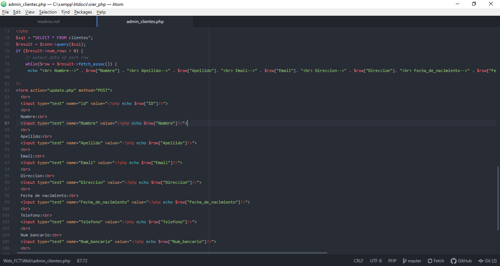
  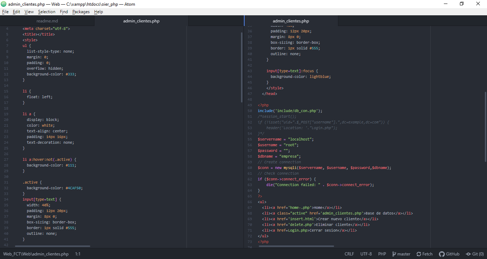
  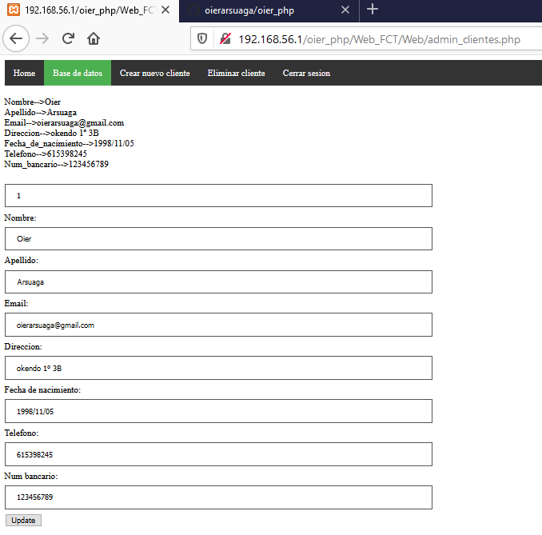
   
   
  3.5-Insercion de nuevos clientes
   
  Continuando con la documentacion de la web podremos encontrar los dos siguientes archivos cuales se llaman insert.html y insertar.php. En el archivo .html podemos encontrar una estructura similar al from del update pero este es diferentes porque este from sirve para la insercion de nuevos clientes a la base de datos y tienes los style para que se pueda ver como en la ultima foto. En el archivo .php podemos encontrar la coneccion con la base de datos que sigue la misma estructuraque las anteriores va desde la linea 2 asta la linea 16. Por el otro lado despuesde la conexion tenemos las lineas donde se las funciones y se les asigna un nombre y despues podemos apreciar el comando SQL pero esta vez tenemos el de insert into con sus correspondientes datos. Y en la ultima foto podemos apreciar como se ve la parte de la insercion  en la web.
     
   
  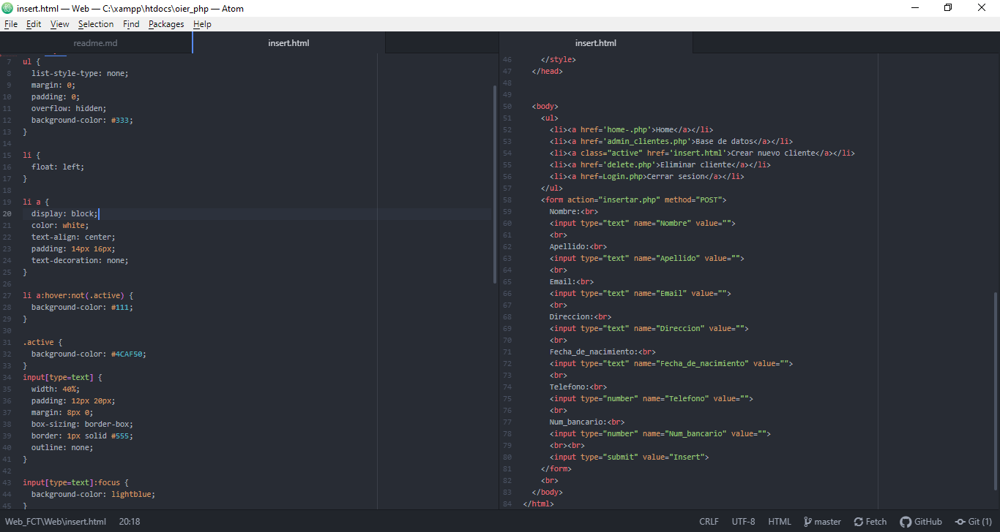
  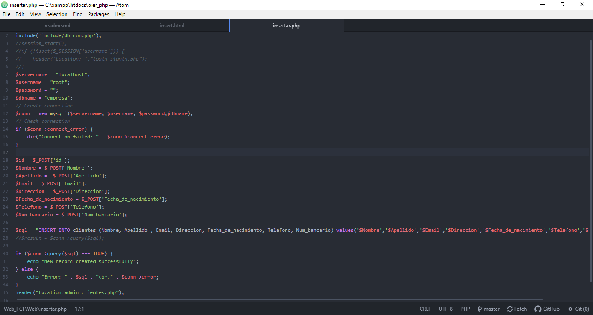
  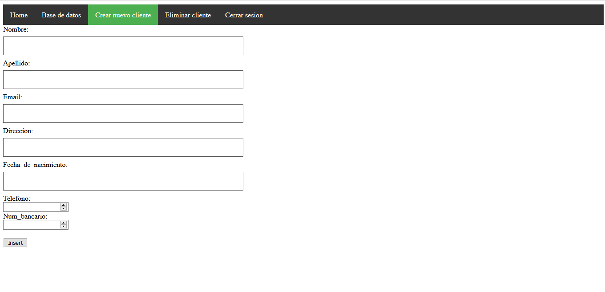
   
   
  3.6-Eliminar clientes
   
  Como podemos apreciar la siguiente opcion que nos ofrece nuestra barra de navigacion es la de eliminar clientes. Como podemos apreciar en la parte izquierda de la primera foto se encuentran las diferentes caracteristicas que utiliza la barra de navegacion, siguiendo en la misma foto pero el lado contrario podemos ver al comiezo las variables utilizadas para la conexion con la base de datos, a continuacion se encuentra la parte para la barra de navigacion, la ultima parte de la foto nos muestra la consulta SQL realizada en y el from con el que se elimina los clientes. Este boton en un action del archivo delete_art.php que podemos apreciar en la segunda foto y contiene primero la conexion con la base de datos, la consulta SQL (con el que se usa el delete from...) a realizar y el header de a donde redirigiremos.
     
   
  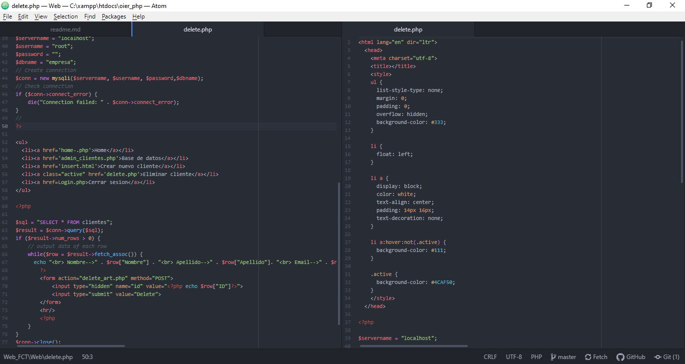
  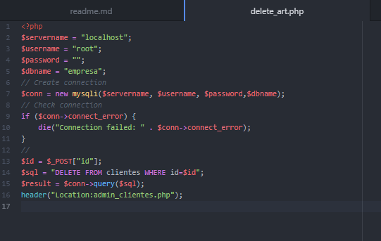
  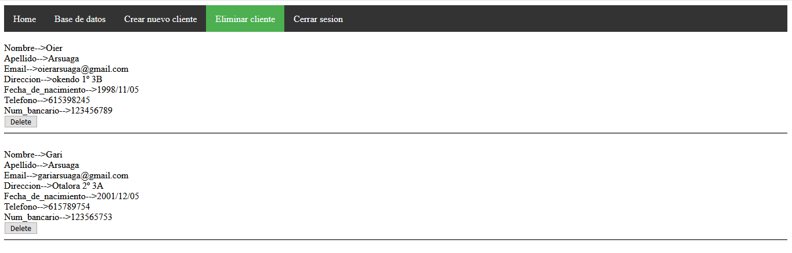
   
   
  3.7-modificar datos de clientes
   
  Por ultimo tenemos la opcion de actualizar los datos de nuestro cliente por si este realizar cualquier cambio en su vida, esta opcion la encontramos añadida en la parte de base de datos de nuestra barra de navigacion. Para la creacion de esta funcion necesitaremos las siguientes cosas que ademas podeis ver en las sguientes tres imagenes, en la primera poderemos aprecias un from en el que visualizamos todos los datos de nuestro cliente y esta informacion se Visializa en cuadrados donde podremos modifcar dicha informacion y pulsando el boton update este nos ejecutara un actin del archivo update.php este realiza las siguientes 3 cosas principalmente, primero tenemos la conexion con la base de datos, despues tienes la copilacion de las variables que vamos a llegar a utilizar  en la siguiente consulta SQL (la consulta es el de update como vemos en la imagen) que es lo que realiza el boton.
     
   
  
  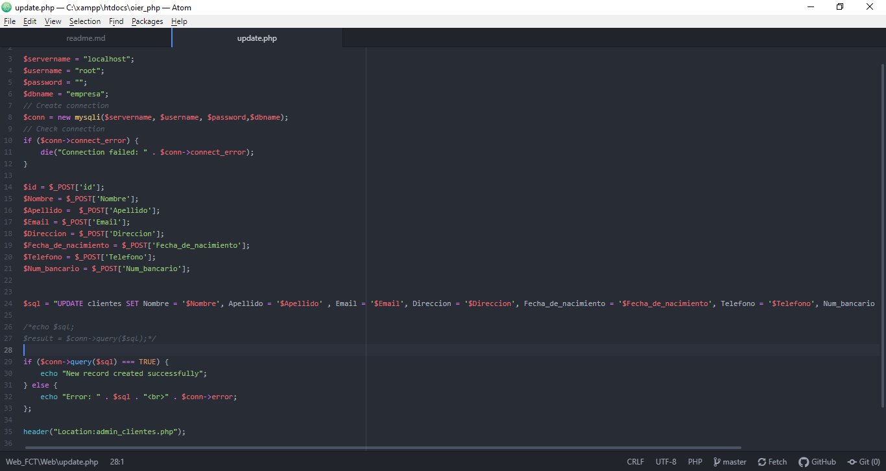
  
   
   
